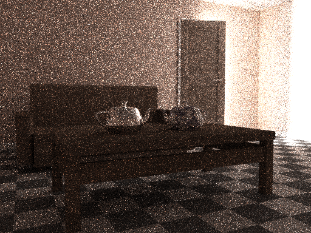
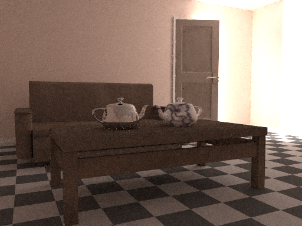
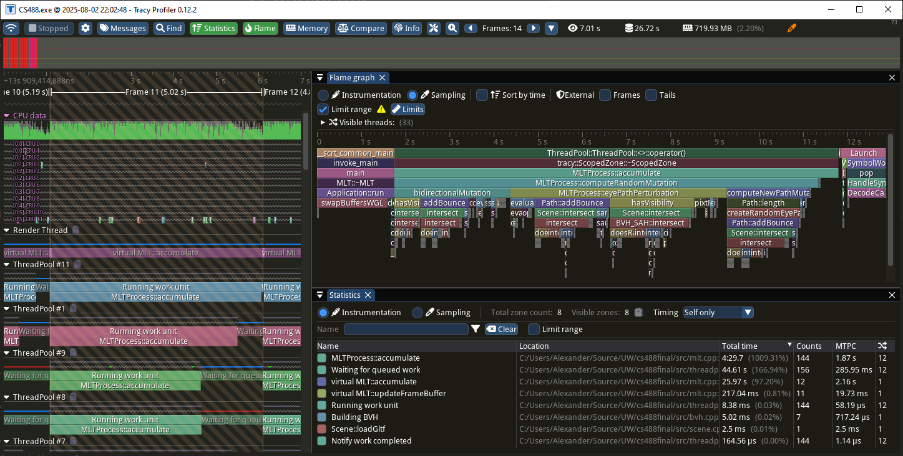

# Metropolis Light Transport Implementation

This project was created by Maxwell Hunt & [Alexander Kaminsky](https://github.com/kaminskyalexander/)

<table>
    <tr>
        <td></td>
        <td></td>
    </tr>
    <tr>
        <td>Path Tracing</td>
        <td>Metropolis Light Transport</td>
    </tr>
</table>

## Overview

In this project we implement a modified version of Veach and Guibas' original 1997 Metropolis Light Transport algorithm. Our program allows for loading scenes from `.glb` files and rendering them either using a unidirectional path tracer or our MLT algorithm. Use the `WSAD` keys to move around and press `I` to save a screen-shot.

**Usage:** `MLT [--help] [--jobs NUM_JOBS] [--use-path-tracer] [--mutations MUTATIONS] glb-file`

**Positional arguments:**
- `glb-file`                     The .glb file to load into the scene. [required]

**Optional arguments:**
- `-h`, `--help`                 Shows help message and exits.
- `-j`, `--jobs` `NUM_JOBS`
   The size of the thread pool. By default, the hardware concurrency is used. A value less than 2 disables the thread pool.
- `--pt`, `--use-path-tracer`    Use regular path tracing instead of MLT.
- `-m`, `--mutations` `MUTATIONS`
  Specifies a custom set of enabled mutators for MLT. The set should be passed 
  as a comma-separated list of the enabled mutators from the set
  {newPathMutation, lensPerturbation, multiChainPerturbation,
  bidirectionalMutation}, with no spaces. The full name does not need to be
  provided; the closest match will be used.
  

**Example usage:** `MLT ../media/room_far.glb -m new,lens -j 8`

## Building

This project requires CMake version 3.25 and a compiler with support for C++23.
```
mkdir build
cd build
cmake ..
cmake --build . --config Release
```

## Profiling with Tracy



Our code has been instrumented with the help of
[Tracy](https://github.com/wolfpld/tracy) to assist in identifying performance
bottlenecks.

To enable profiling in the build, instead use:

```
cmake -DTRACY_ENABLE=ON ..
```

Once built, run the application as usual. Profiling of instrumented code will be
enabled automatially. In order to profile using sampling, the application needs
to be run with administrative privileges.

Finally, install
[Tracy Profiler 0.12.2](https://github.com/wolfpld/tracy/releases/tag/v0.12.2)
and run it to connect to the application.

## Implementation
We use a bounding volume heirarchy with the surface area heuristic to speed up ray-triangle intersections. Our code is also multithreaded by default (use `-j` option to set the number of threads used). Implementing Metropolis Light Transport demanded a deep and thourough understanding of the theoretical background and the implementation details which drive the algorithm. The paper that this project was based on is given here: [Veach & Guibas](https://graphics.stanford.edu/papers/metro/metro.pdf).

## Caveats
Note that the Metropolis Light Transport shines best on scenes with difficult lighting (such as the provided `room_far.glb` scene). For scenes with many large light sources, the path tracer may perform better and this is to be expected. That being said, our MLT implementation should still stay competitive with the path tracing implementation. Additionally, because our MLT implementation is unidirectional it does not perform as well with glass and caustics as the implementation presented by Veach and Guibas. 

## Attribution

The scenes `media/room_close.glb` and `media/room_far.glb` use select assets
from the [Living room Asset Pack](https://sketchfab.com/3d-models/living-room-asset-pack-eafcacc7dc8643d68b435b177d049567)
by [shadowdraak](https://sketchfab.com/shadowdraak), licensed under
[Creative Commons Attribution (CC BY 4.0)](https://creativecommons.org/licenses/by/4.0/).
